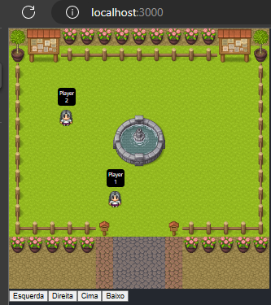

# Project Game RPG

open project

###  `cd rpg`

In the project directory, you can run:

###  `npm install` 

Install dependencies

### `npm start`

Runs the app in the development mode.\
Open [http://localhost:3000/](http://localhost:3000/) to view it in your browser.

## Tecnologies

- REACT
- TYPESCRIPT
- Git E Github

